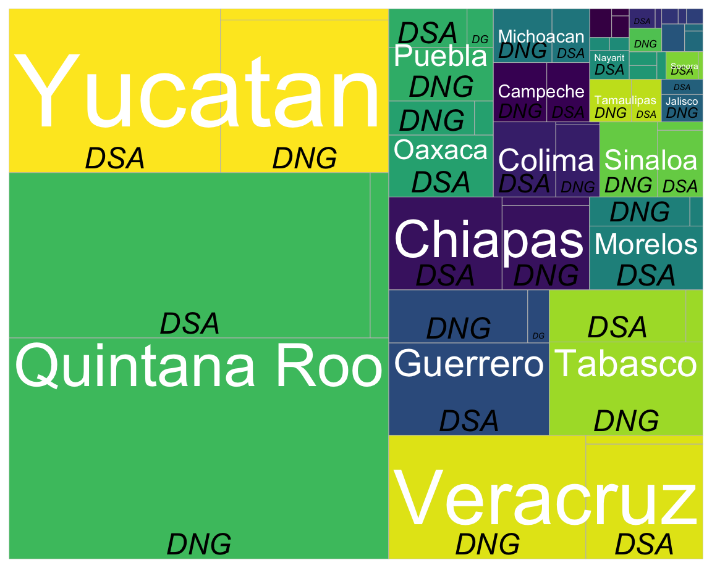
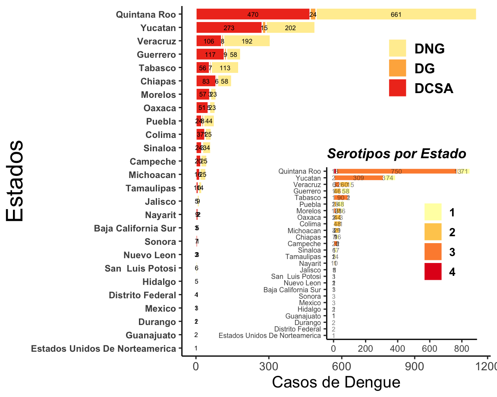
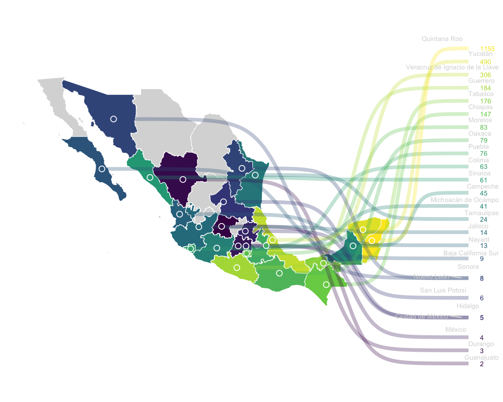

<div class="knitr-options" data-fig-width="576" data-fig-height="460"></div>


# **Vigilancia Epidemiológica**

## Column {.tabset}

### [**Casos por Estado**]{style="color:#7d9029"}

<html>

<head>

```{=html}
<style>
</style>
```
</head>

<body>

<div>

<h2>

</h2>

<p>

</p>

::: {style="display: grid; width: 1px; grid-template-columns: 700px 700px; align-items: start; justify-content: space-between;"}
#### [**Treemap de casos confirmados**]{style="color:blue"}

<div class="knitr-options" data-fig-width="576" data-fig-height="460"></div>


<div>

#### [**Casos confirmados y serotipos**]{style="color:blue"}

<div class="knitr-options" data-fig-width="576" data-fig-height="460"></div>


</div>
:::

#### [**Casos confirmados por semana**]{style="color:blue"}

<div class="knitr-options" data-fig-width="576" data-fig-height="460"></div>

```{=html}
<div id="htmlwidget-2ac5749066c257824a34" style="width:576px;height:460.8px;" class="plotly html-widget"></div>
<script type="application/json" data-for="htmlwidget-2ac5749066c257824a34">{"x":{"data":[{"x":[1],"y":[1,2,3],"z":[[0],[1],[1]],"text":[["week: 1<br />edo: Quintana Roo<br />n: 1<br />n: 1"],["week: 1<br />edo: Veracruz<br />n: 2<br />n: 2"],["week: 1<br />edo: Yucatan<br />n: 2<br />n: 2"]],"colorscale":[[0,"#440154"],[1,"#FDE725"]],"type":"heatmap","showscale":false,"autocolorscale":false,"showlegend":false,"xaxis":"x","yaxis":"y","hoverinfo":"text","frame":null},{"x":[1,1],"y":[2,3],"text":[2,2],"hovertext":["week: 1<br />edo: Veracruz<br />n: 2<br />n: 2","week: 1<br />edo: Yucatan<br />n: 2<br />n: 2"],"textfont":{"size":11.3385826771654,"color":"rgba(0,0,0,0.4)"},"type":"scatter","mode":"text","hoveron":"points","showlegend":false,"xaxis":"x","yaxis":"y","hoverinfo":"text","frame":null},{"x":[1],"y":[1],"text":1,"hovertext":"week: 1<br />edo: Quintana Roo<br />n: 1<br />n: 1","textfont":{"size":11.3385826771654,"color":"rgba(190,190,190,0.4)"},"type":"scatter","mode":"text","hoveron":"points","showlegend":false,"xaxis":"x","yaxis":"y","hoverinfo":"text","frame":null},{"x":[1],"y":[1],"name":"99_fc7a94861334e234a79303e88668c4b2","type":"scatter","mode":"markers","opacity":0,"hoverinfo":"skip","showlegend":false,"marker":{"color":[0,1],"colorscale":[[0,"#440154"],[0.00334448160535117,"#440355"],[0.00668896321070234,"#440456"],[0.0100334448160535,"#440656"],[0.0133779264214047,"#450857"],[0.0167224080267558,"#450958"],[0.020066889632107,"#450B59"],[0.0234113712374582,"#450D5A"],[0.0267558528428093,"#450E5B"],[0.0301003344481605,"#45105B"],[0.0334448160535117,"#45115C"],[0.0367892976588629,"#45135D"],[0.040133779264214,"#45145E"],[0.0434782608695652,"#45155F"],[0.0468227424749164,"#451760"],[0.0501672240802675,"#451860"],[0.0535117056856187,"#451961"],[0.0568561872909699,"#461A62"],[0.060200668896321,"#461B63"],[0.0635451505016722,"#461D64"],[0.0668896321070234,"#461E65"],[0.0702341137123745,"#461F65"],[0.0735785953177257,"#462066"],[0.0769230769230769,"#462167"],[0.080267558528428,"#462268"],[0.0836120401337792,"#462369"],[0.0869565217391304,"#46246A"],[0.0903010033444815,"#46256B"],[0.0936454849498327,"#46266B"],[0.0969899665551839,"#46276C"],[0.100334448160535,"#46286D"],[0.103678929765886,"#46296E"],[0.107023411371237,"#462A6F"],[0.110367892976589,"#452B70"],[0.11371237458194,"#452C70"],[0.117056856187291,"#452D71"],[0.120401337792642,"#452E72"],[0.123745819397993,"#452F73"],[0.127090301003344,"#453074"],[0.130434782608696,"#453175"],[0.133779264214047,"#453276"],[0.137123745819398,"#453377"],[0.140468227424749,"#453477"],[0.1438127090301,"#443578"],[0.147157190635451,"#443679"],[0.150501672240803,"#44367A"],[0.153846153846154,"#44377B"],[0.157190635451505,"#44387C"],[0.160535117056856,"#44397D"],[0.163879598662207,"#443A7D"],[0.167224080267558,"#433B7E"],[0.17056856187291,"#433C7F"],[0.173913043478261,"#433D80"],[0.177257525083612,"#433E81"],[0.180602006688963,"#433F82"],[0.183946488294314,"#424083"],[0.187290969899665,"#424184"],[0.190635451505017,"#424185"],[0.193979933110368,"#424285"],[0.197324414715719,"#414386"],[0.20066889632107,"#414487"],[0.204013377926421,"#414587"],[0.207357859531773,"#414687"],[0.210702341137124,"#414787"],[0.214046822742475,"#414888"],[0.217391304347826,"#404988"],[0.220735785953177,"#404A88"],[0.224080267558529,"#404A88"],[0.22742474916388,"#404B88"],[0.230769230769231,"#404C88"],[0.234113712374582,"#404D88"],[0.237458193979933,"#404E88"],[0.240802675585284,"#3F4F89"],[0.244147157190636,"#3F5089"],[0.247491638795987,"#3F5189"],[0.250836120401338,"#3F5289"],[0.254180602006689,"#3F5289"],[0.25752508361204,"#3E5389"],[0.260869565217391,"#3E5489"],[0.264214046822743,"#3E5589"],[0.267558528428094,"#3E568A"],[0.270903010033445,"#3D578A"],[0.274247491638796,"#3D588A"],[0.277591973244147,"#3D598A"],[0.280936454849498,"#3D598A"],[0.28428093645485,"#3C5A8A"],[0.287625418060201,"#3C5B8A"],[0.290969899665552,"#3C5C8A"],[0.294314381270903,"#3B5D8A"],[0.297658862876254,"#3B5E8B"],[0.301003344481605,"#3B5F8B"],[0.304347826086957,"#3A5F8B"],[0.307692307692308,"#3A608B"],[0.311036789297659,"#3A618B"],[0.31438127090301,"#39628B"],[0.317725752508361,"#39638B"],[0.321070234113712,"#38648B"],[0.324414715719064,"#38658C"],[0.327759197324415,"#38658C"],[0.331103678929766,"#37668C"],[0.334448160535117,"#37678C"],[0.337792642140468,"#36688C"],[0.341137123745819,"#36698C"],[0.344481605351171,"#356A8C"],[0.347826086956522,"#356B8C"],[0.351170568561873,"#346B8C"],[0.354515050167224,"#346C8D"],[0.357859531772575,"#336D8D"],[0.361204013377926,"#326E8D"],[0.364548494983278,"#326F8D"],[0.367892976588629,"#31708D"],[0.37123745819398,"#31718D"],[0.374581939799331,"#30718D"],[0.377926421404682,"#2F728D"],[0.381270903010033,"#2F738D"],[0.384615384615385,"#2E748E"],[0.387959866220736,"#2D758E"],[0.391304347826087,"#2C768E"],[0.394648829431438,"#2B778E"],[0.397993311036789,"#2B778E"],[0.40133779264214,"#2A788E"],[0.404682274247492,"#2A798E"],[0.408026755852843,"#2A7A8E"],[0.411371237458194,"#2B7B8E"],[0.414715719063545,"#2B7B8D"],[0.418060200668896,"#2B7C8D"],[0.421404682274247,"#2B7D8D"],[0.424749163879599,"#2B7E8D"],[0.42809364548495,"#2B7F8D"],[0.431438127090301,"#2B7F8D"],[0.434782608695652,"#2B808D"],[0.438127090301003,"#2B818C"],[0.441471571906354,"#2B828C"],[0.444816053511706,"#2B838C"],[0.448160535117057,"#2C838C"],[0.451505016722408,"#2C848C"],[0.454849498327759,"#2C858C"],[0.45819397993311,"#2C868B"],[0.461538461538461,"#2C878B"],[0.464882943143813,"#2C878B"],[0.468227424749164,"#2C888B"],[0.471571906354515,"#2C898B"],[0.474916387959866,"#2C8A8B"],[0.478260869565217,"#2C8B8B"],[0.481605351170569,"#2B8B8A"],[0.48494983277592,"#2B8C8A"],[0.488294314381271,"#2B8D8A"],[0.491638795986622,"#2B8E8A"],[0.494983277591973,"#2B8F8A"],[0.498327759197324,"#2B8F8A"],[0.501672240802676,"#2B9089"],[0.505016722408027,"#2B9189"],[0.508361204013378,"#2B9289"],[0.511705685618729,"#2B9389"],[0.51505016722408,"#2A9389"],[0.518394648829431,"#2A9489"],[0.521739130434783,"#2A9588"],[0.525083612040134,"#2A9688"],[0.528428093645485,"#2A9788"],[0.531772575250836,"#2A9788"],[0.535117056856187,"#299888"],[0.538461538461538,"#299987"],[0.54180602006689,"#299A87"],[0.545150501672241,"#299B87"],[0.548494983277592,"#289B87"],[0.551839464882943,"#289C87"],[0.555183946488294,"#289D87"],[0.558528428093645,"#279E86"],[0.561872909698997,"#279F86"],[0.565217391304348,"#27A086"],[0.568561872909699,"#26A086"],[0.57190635451505,"#26A186"],[0.575250836120401,"#26A285"],[0.578595317725752,"#25A385"],[0.581939799331104,"#25A485"],[0.585284280936455,"#24A485"],[0.588628762541806,"#24A585"],[0.591973244147157,"#23A684"],[0.595317725752508,"#23A784"],[0.598662207357859,"#22A884"],[0.602006688963211,"#24A884"],[0.605351170568562,"#27A983"],[0.608695652173913,"#2AAA82"],[0.612040133779264,"#2DAA81"],[0.615384615384615,"#2FAB81"],[0.618729096989967,"#32AC80"],[0.622073578595318,"#34AC7F"],[0.625418060200669,"#36AD7E"],[0.62876254180602,"#38AE7E"],[0.632107023411371,"#3AAE7D"],[0.635451505016722,"#3CAF7C"],[0.638795986622074,"#3EB07B"],[0.642140468227425,"#40B07B"],[0.645484949832776,"#42B17A"],[0.648829431438127,"#43B279"],[0.652173913043478,"#45B278"],[0.655518394648829,"#47B378"],[0.658862876254181,"#48B477"],[0.662207357859532,"#4AB476"],[0.665551839464883,"#4BB575"],[0.668896321070234,"#4DB675"],[0.672240802675585,"#4EB674"],[0.675585284280936,"#50B773"],[0.678929765886288,"#51B872"],[0.682274247491639,"#53B971"],[0.68561872909699,"#54B971"],[0.688963210702341,"#55BA70"],[0.692307692307692,"#57BB6F"],[0.695652173913043,"#58BB6E"],[0.698996655518395,"#59BC6D"],[0.702341137123746,"#5BBD6C"],[0.705685618729097,"#5CBD6C"],[0.709030100334448,"#5DBE6B"],[0.712374581939799,"#5EBF6A"],[0.71571906354515,"#5FBF69"],[0.719063545150502,"#61C068"],[0.722408026755853,"#62C167"],[0.725752508361204,"#63C166"],[0.729096989966555,"#64C266"],[0.732441471571906,"#65C365"],[0.735785953177257,"#66C464"],[0.739130434782609,"#67C463"],[0.74247491638796,"#69C562"],[0.745819397993311,"#6AC661"],[0.749163879598662,"#6BC660"],[0.752508361204013,"#6CC75F"],[0.755852842809364,"#6DC85E"],[0.759197324414716,"#6EC85D"],[0.762541806020067,"#6FC95C"],[0.765886287625418,"#70CA5B"],[0.769230769230769,"#71CB5A"],[0.772575250836121,"#72CB59"],[0.775919732441471,"#73CC58"],[0.779264214046823,"#74CD57"],[0.782608695652174,"#75CD56"],[0.785953177257525,"#76CE55"],[0.789297658862876,"#77CF54"],[0.792642140468228,"#78CF53"],[0.795986622073579,"#79D052"],[0.79933110367893,"#7AD151"],[0.802675585284281,"#7CD151"],[0.806020066889632,"#7FD250"],[0.809364548494983,"#81D250"],[0.812709030100335,"#84D34F"],[0.816053511705686,"#87D34F"],[0.819397993311037,"#89D34E"],[0.822742474916388,"#8CD44D"],[0.826086956521739,"#8ED44D"],[0.82943143812709,"#91D54C"],[0.832775919732442,"#93D54C"],[0.836120401337793,"#95D54B"],[0.839464882943144,"#98D64B"],[0.842809364548495,"#9AD64A"],[0.846153846153846,"#9DD74A"],[0.849498327759197,"#9FD749"],[0.852842809364549,"#A1D748"],[0.8561872909699,"#A3D848"],[0.859531772575251,"#A6D847"],[0.862876254180602,"#A8D947"],[0.866220735785953,"#AAD946"],[0.869565217391304,"#ACD946"],[0.872909698996656,"#AFDA45"],[0.876254180602007,"#B1DA44"],[0.879598662207358,"#B3DB44"],[0.882943143812709,"#B5DB43"],[0.88628762541806,"#B7DB42"],[0.889632107023411,"#BADC42"],[0.892976588628763,"#BCDC41"],[0.896321070234114,"#BEDC40"],[0.899665551839465,"#C0DD40"],[0.903010033444816,"#C2DD3F"],[0.906354515050167,"#C4DE3E"],[0.909698996655518,"#C6DE3E"],[0.91304347826087,"#C8DE3D"],[0.916387959866221,"#CBDF3C"],[0.919732441471572,"#CDDF3B"],[0.923076923076923,"#CFDF3B"],[0.926421404682274,"#D1E03A"],[0.929765886287625,"#D3E039"],[0.933110367892977,"#D5E038"],[0.936454849498328,"#D7E138"],[0.939799331103679,"#D9E137"],[0.94314381270903,"#DBE136"],[0.946488294314381,"#DDE235"],[0.949832775919732,"#DFE234"],[0.953177257525084,"#E1E233"],[0.956521739130435,"#E3E333"],[0.959866220735786,"#E5E332"],[0.963210702341137,"#E7E331"],[0.966555183946488,"#E9E430"],[0.969899665551839,"#EBE42F"],[0.973244147157191,"#EDE42E"],[0.976588628762542,"#EFE52D"],[0.979933110367893,"#F1E52C"],[0.983277591973244,"#F3E52B"],[0.986622073578595,"#F5E62A"],[0.989966555183946,"#F7E629"],[0.993311036789298,"#F9E627"],[0.996655518394649,"#FBE726"],[1,"#FDE725"]],"colorbar":{"bgcolor":null,"bordercolor":null,"borderwidth":0,"thickness":18.8976377952756,"title":"","titlefont":{"color":"rgba(0,0,0,1)","family":"","size":18.5969281859693},"tickmode":"array","ticktext":["1.00","1.25","1.50","1.75","2.00"],"tickvals":[0,0.25,0.5,0.75,1],"tickfont":{"color":"rgba(0,0,0,1)","family":"","size":15.9402241594022},"ticklen":2,"len":0.5}},"xaxis":"x","yaxis":"y","frame":null}],"layout":{"margin":{"t":27.6432941686069,"r":9.29846409298464,"b":24.2626382948003,"l":85.678704856787},"font":{"color":"rgba(0,0,0,1)","family":"","size":18.5969281859693},"xaxis":{"domain":[0,1],"automargin":true,"type":"linear","autorange":false,"range":[0.45,1.55],"tickmode":"array","ticktext":["1"],"tickvals":[1],"categoryorder":"array","categoryarray":["1"],"nticks":null,"ticks":"outside","tickcolor":"rgba(0,0,0,1)","ticklen":4.64923204649232,"tickwidth":0,"showticklabels":true,"tickfont":{"color":"rgba(0,0,0,1)","family":"","size":7.97011207970112},"tickangle":-0,"showline":true,"linecolor":"rgba(0,0,0,1)","linewidth":0,"showgrid":false,"gridcolor":null,"gridwidth":0,"zeroline":false,"anchor":"y","title":{"text":"","font":{"color":"rgba(0,0,0,1)","family":"","size":18.5969281859693}},"hoverformat":".2f"},"yaxis":{"domain":[0,1],"automargin":true,"type":"linear","autorange":false,"range":[0.4,3.6],"tickmode":"array","ticktext":["Quintana Roo","Veracruz","Yucatan"],"tickvals":[1,2,3],"categoryorder":"array","categoryarray":["Quintana Roo","Veracruz","Yucatan"],"nticks":null,"ticks":"outside","tickcolor":"rgba(0,0,0,1)","ticklen":4.64923204649232,"tickwidth":0,"showticklabels":true,"tickfont":{"color":"rgba(0,0,0,1)","family":"","size":11.9551681195517},"tickangle":-0,"showline":true,"linecolor":"rgba(0,0,0,1)","linewidth":0,"showgrid":false,"gridcolor":null,"gridwidth":0,"zeroline":false,"anchor":"x","title":{"text":"","font":{"color":"rgba(0,0,0,1)","family":"","size":18.5969281859693}},"hoverformat":".2f"},"shapes":[{"type":"rect","fillcolor":null,"line":{"color":null,"width":0,"linetype":[]},"yref":"paper","xref":"paper","x0":0,"x1":1,"y0":0,"y1":1}],"showlegend":false,"legend":{"bgcolor":null,"bordercolor":null,"borderwidth":0,"font":{"color":"rgba(0,0,0,1)","family":"","size":15.9402241594022},"title":{"text":"","font":{"color":"rgba(0,0,0,1)","family":"","size":18.5969281859693}}},"hovermode":"closest","barmode":"relative"},"config":{"doubleClick":"reset","modeBarButtonsToAdd":["hoverclosest","hovercompare"],"showSendToCloud":false},"source":"A","attrs":{"6805d586ec5":{"x":{},"y":{},"fill":{},"label":{},"type":"heatmap"},"680246462fc":{"x":{},"y":{},"fill":{},"label":{}}},"cur_data":"6805d586ec5","visdat":{"6805d586ec5":["function (y) ","x"],"680246462fc":["function (y) ","x"]},"highlight":{"on":"plotly_click","persistent":false,"dynamic":false,"selectize":false,"opacityDim":0.2,"selected":{"opacity":1},"debounce":0},"shinyEvents":["plotly_hover","plotly_click","plotly_selected","plotly_relayout","plotly_brushed","plotly_brushing","plotly_clickannotation","plotly_doubleclick","plotly_deselect","plotly_afterplot","plotly_sunburstclick"],"base_url":"https://plot.ly"},"evals":[],"jsHooks":[]}</script>
```


#### [**Casos Confirmados**]{style="color:blue"}

<div class="knitr-options" data-fig-width="576" data-fig-height="460"></div>


</div>
</body>
</html>

### [**Casos Confirmados por JS & Municipio**]{style="color:#7d9029"}

<html>

<head>

```{=html}
<style>
.myDiv1 {
  border: 2px outset darkgreen;
  background-color: darkgreen;
  text-align: center;
}
</style>
```
</head>

<body>

::: myDiv1
<h2>

</h2>

<p>

</p>

#### [**Casos por Semana & Jurisdición**]{style="color:#7d9029"}

<div class="knitr-options" data-fig-width="576" data-fig-height="460"></div>

```{=html}
<div id="htmlwidget-ef440f61443280d9765d" style="width:576px;height:460.8px;" class="plotly html-widget"></div>
<script type="application/json" data-for="htmlwidget-ef440f61443280d9765d">{"x":{"data":[{"x":[1],"y":[1],"z":[[0.5]],"text":[["week: 1<br />DES_JUR_RES: Valladolid<br />n: 2<br />n: 2"]],"colorscale":[[0.5,"#2B9089"]],"type":"heatmap","showscale":false,"autocolorscale":false,"showlegend":false,"xaxis":"x","yaxis":"y","hoverinfo":"text","frame":null},{"x":[1],"y":[1],"text":2,"hovertext":"week: 1<br />DES_JUR_RES: Valladolid<br />n: 2<br />n: 2","textfont":{"size":11.3385826771654,"color":"rgba(0,0,0,0.4)"},"type":"scatter","mode":"text","hoveron":"points","showlegend":false,"xaxis":"x","yaxis":"y","hoverinfo":"text","frame":null},{"x":[1],"y":[1],"name":"99_b54c87b955f35176afcdd48c30260dba","type":"scatter","mode":"markers","opacity":0,"hoverinfo":"skip","showlegend":false,"marker":{"color":[0,1],"colorscale":[[0.5,"#2B9089"],[0.5,"#2B9089"],[0.5,"#2B9089"],[0.5,"#2B9089"],[0.5,"#2B9089"],[0.5,"#2B9089"],[0.5,"#2B9089"],[0.5,"#2B9089"],[0.5,"#2B9089"],[0.5,"#2B9089"],[0.5,"#2B9089"],[0.5,"#2B9089"],[0.5,"#2B9089"],[0.5,"#2B9089"],[0.5,"#2B9089"],[0.5,"#2B9089"],[0.5,"#2B9089"],[0.5,"#2B9089"],[0.5,"#2B9089"],[0.5,"#2B9089"],[0.5,"#2B9089"],[0.5,"#2B9089"],[0.5,"#2B9089"],[0.5,"#2B9089"],[0.5,"#2B9089"],[0.5,"#2B9089"],[0.5,"#2B9089"],[0.5,"#2B9089"],[0.5,"#2B9089"],[0.5,"#2B9089"],[0.5,"#2B9089"],[0.5,"#2B9089"],[0.5,"#2B9089"],[0.5,"#2B9089"],[0.5,"#2B9089"],[0.5,"#2B9089"],[0.5,"#2B9089"],[0.5,"#2B9089"],[0.5,"#2B9089"],[0.5,"#2B9089"],[0.5,"#2B9089"],[0.5,"#2B9089"],[0.5,"#2B9089"],[0.5,"#2B9089"],[0.5,"#2B9089"],[0.5,"#2B9089"],[0.5,"#2B9089"],[0.5,"#2B9089"],[0.5,"#2B9089"],[0.5,"#2B9089"],[0.5,"#2B9089"],[0.5,"#2B9089"],[0.5,"#2B9089"],[0.5,"#2B9089"],[0.5,"#2B9089"],[0.5,"#2B9089"],[0.5,"#2B9089"],[0.5,"#2B9089"],[0.5,"#2B9089"],[0.5,"#2B9089"],[0.5,"#2B9089"],[0.5,"#2B9089"],[0.5,"#2B9089"],[0.5,"#2B9089"],[0.5,"#2B9089"],[0.5,"#2B9089"],[0.5,"#2B9089"],[0.5,"#2B9089"],[0.5,"#2B9089"],[0.5,"#2B9089"],[0.5,"#2B9089"],[0.5,"#2B9089"],[0.5,"#2B9089"],[0.5,"#2B9089"],[0.5,"#2B9089"],[0.5,"#2B9089"],[0.5,"#2B9089"],[0.5,"#2B9089"],[0.5,"#2B9089"],[0.5,"#2B9089"],[0.5,"#2B9089"],[0.5,"#2B9089"],[0.5,"#2B9089"],[0.5,"#2B9089"],[0.5,"#2B9089"],[0.5,"#2B9089"],[0.5,"#2B9089"],[0.5,"#2B9089"],[0.5,"#2B9089"],[0.5,"#2B9089"],[0.5,"#2B9089"],[0.5,"#2B9089"],[0.5,"#2B9089"],[0.5,"#2B9089"],[0.5,"#2B9089"],[0.5,"#2B9089"],[0.5,"#2B9089"],[0.5,"#2B9089"],[0.5,"#2B9089"],[0.5,"#2B9089"],[0.5,"#2B9089"],[0.5,"#2B9089"],[0.5,"#2B9089"],[0.5,"#2B9089"],[0.5,"#2B9089"],[0.5,"#2B9089"],[0.5,"#2B9089"],[0.5,"#2B9089"],[0.5,"#2B9089"],[0.5,"#2B9089"],[0.5,"#2B9089"],[0.5,"#2B9089"],[0.5,"#2B9089"],[0.5,"#2B9089"],[0.5,"#2B9089"],[0.5,"#2B9089"],[0.5,"#2B9089"],[0.5,"#2B9089"],[0.5,"#2B9089"],[0.5,"#2B9089"],[0.5,"#2B9089"],[0.5,"#2B9089"],[0.5,"#2B9089"],[0.5,"#2B9089"],[0.5,"#2B9089"],[0.5,"#2B9089"],[0.5,"#2B9089"],[0.5,"#2B9089"],[0.5,"#2B9089"],[0.5,"#2B9089"],[0.5,"#2B9089"],[0.5,"#2B9089"],[0.5,"#2B9089"],[0.5,"#2B9089"],[0.5,"#2B9089"],[0.5,"#2B9089"],[0.5,"#2B9089"],[0.5,"#2B9089"],[0.5,"#2B9089"],[0.5,"#2B9089"],[0.5,"#2B9089"],[0.5,"#2B9089"],[0.5,"#2B9089"],[0.5,"#2B9089"],[0.5,"#2B9089"],[0.5,"#2B9089"],[0.5,"#2B9089"],[0.5,"#2B9089"],[0.5,"#2B9089"],[0.5,"#2B9089"],[0.5,"#2B9089"],[0.5,"#2B9089"],[0.5,"#2B9089"],[0.5,"#2B9089"],[0.5,"#2B9089"],[0.5,"#2B9089"],[0.5,"#2B9089"],[0.5,"#2B9089"],[0.5,"#2B9089"],[0.5,"#2B9089"],[0.5,"#2B9089"],[0.5,"#2B9089"],[0.5,"#2B9089"],[0.5,"#2B9089"],[0.5,"#2B9089"],[0.5,"#2B9089"],[0.5,"#2B9089"],[0.5,"#2B9089"],[0.5,"#2B9089"],[0.5,"#2B9089"],[0.5,"#2B9089"],[0.5,"#2B9089"],[0.5,"#2B9089"],[0.5,"#2B9089"],[0.5,"#2B9089"],[0.5,"#2B9089"],[0.5,"#2B9089"],[0.5,"#2B9089"],[0.5,"#2B9089"],[0.5,"#2B9089"],[0.5,"#2B9089"],[0.5,"#2B9089"],[0.5,"#2B9089"],[0.5,"#2B9089"],[0.5,"#2B9089"],[0.5,"#2B9089"],[0.5,"#2B9089"],[0.5,"#2B9089"],[0.5,"#2B9089"],[0.5,"#2B9089"],[0.5,"#2B9089"],[0.5,"#2B9089"],[0.5,"#2B9089"],[0.5,"#2B9089"],[0.5,"#2B9089"],[0.5,"#2B9089"],[0.5,"#2B9089"],[0.5,"#2B9089"],[0.5,"#2B9089"],[0.5,"#2B9089"],[0.5,"#2B9089"],[0.5,"#2B9089"],[0.5,"#2B9089"],[0.5,"#2B9089"],[0.5,"#2B9089"],[0.5,"#2B9089"],[0.5,"#2B9089"],[0.5,"#2B9089"],[0.5,"#2B9089"],[0.5,"#2B9089"],[0.5,"#2B9089"],[0.5,"#2B9089"],[0.5,"#2B9089"],[0.5,"#2B9089"],[0.5,"#2B9089"],[0.5,"#2B9089"],[0.5,"#2B9089"],[0.5,"#2B9089"],[0.5,"#2B9089"],[0.5,"#2B9089"],[0.5,"#2B9089"],[0.5,"#2B9089"],[0.5,"#2B9089"],[0.5,"#2B9089"],[0.5,"#2B9089"],[0.5,"#2B9089"],[0.5,"#2B9089"],[0.5,"#2B9089"],[0.5,"#2B9089"],[0.5,"#2B9089"],[0.5,"#2B9089"],[0.5,"#2B9089"],[0.5,"#2B9089"],[0.5,"#2B9089"],[0.5,"#2B9089"],[0.5,"#2B9089"],[0.5,"#2B9089"],[0.5,"#2B9089"],[0.5,"#2B9089"],[0.5,"#2B9089"],[0.5,"#2B9089"],[0.5,"#2B9089"],[0.5,"#2B9089"],[0.5,"#2B9089"],[0.5,"#2B9089"],[0.5,"#2B9089"],[0.5,"#2B9089"],[0.5,"#2B9089"],[0.5,"#2B9089"],[0.5,"#2B9089"],[0.5,"#2B9089"],[0.5,"#2B9089"],[0.5,"#2B9089"],[0.5,"#2B9089"],[0.5,"#2B9089"],[0.5,"#2B9089"],[0.5,"#2B9089"],[0.5,"#2B9089"],[0.5,"#2B9089"],[0.5,"#2B9089"],[0.5,"#2B9089"],[0.5,"#2B9089"],[0.5,"#2B9089"],[0.5,"#2B9089"],[0.5,"#2B9089"],[0.5,"#2B9089"],[0.5,"#2B9089"],[0.5,"#2B9089"],[0.5,"#2B9089"],[0.5,"#2B9089"],[0.5,"#2B9089"],[0.5,"#2B9089"],[0.5,"#2B9089"],[0.5,"#2B9089"],[0.5,"#2B9089"],[0.5,"#2B9089"],[0.5,"#2B9089"],[0.5,"#2B9089"],[0.5,"#2B9089"],[0.5,"#2B9089"],[0.5,"#2B9089"],[0.5,"#2B9089"],[0.5,"#2B9089"],[0.5,"#2B9089"],[0.5,"#2B9089"],[0.5,"#2B9089"],[0.5,"#2B9089"],[0.5,"#2B9089"],[0.5,"#2B9089"],[0.5,"#2B9089"],[0.5,"#2B9089"],[0.5,"#2B9089"],[0.5,"#2B9089"],[0.5,"#2B9089"],[0.5,"#2B9089"],[0.5,"#2B9089"],[0.5,"#2B9089"],[0.5,"#2B9089"],[0.5,"#2B9089"],[0.5,"#2B9089"]],"colorbar":{"bgcolor":null,"bordercolor":null,"borderwidth":0,"thickness":18.8976377952756,"title":"","titlefont":{"color":"rgba(0,0,0,1)","family":"","size":18.5969281859693},"tickmode":"array","ticktext":["2"],"tickvals":[0.5],"tickfont":{"color":"rgba(0,0,0,1)","family":"","size":15.9402241594022},"ticklen":2,"len":0.5}},"xaxis":"x","yaxis":"y","frame":null}],"layout":{"margin":{"t":27.6432941686069,"r":9.29846409298464,"b":24.2626382948003,"l":73.7235367372354},"font":{"color":"rgba(0,0,0,1)","family":"","size":18.5969281859693},"xaxis":{"domain":[0,1],"automargin":true,"type":"linear","autorange":false,"range":[0.45,1.55],"tickmode":"array","ticktext":["1"],"tickvals":[1],"categoryorder":"array","categoryarray":["1"],"nticks":null,"ticks":"outside","tickcolor":"rgba(0,0,0,1)","ticklen":4.64923204649232,"tickwidth":0,"showticklabels":true,"tickfont":{"color":"rgba(0,0,0,1)","family":"","size":7.97011207970112},"tickangle":-0,"showline":true,"linecolor":"rgba(0,0,0,1)","linewidth":0,"showgrid":false,"gridcolor":null,"gridwidth":0,"zeroline":false,"anchor":"y","title":{"text":"","font":{"color":"rgba(0,0,0,1)","family":"","size":18.5969281859693}},"hoverformat":".2f"},"yaxis":{"domain":[0,1],"automargin":true,"type":"linear","autorange":false,"range":[0.4,1.6],"tickmode":"array","ticktext":["Valladolid"],"tickvals":[1],"categoryorder":"array","categoryarray":["Valladolid"],"nticks":null,"ticks":"outside","tickcolor":"rgba(0,0,0,1)","ticklen":4.64923204649232,"tickwidth":0,"showticklabels":true,"tickfont":{"color":"rgba(0,0,0,1)","family":"","size":11.9551681195517},"tickangle":-0,"showline":true,"linecolor":"rgba(0,0,0,1)","linewidth":0,"showgrid":false,"gridcolor":null,"gridwidth":0,"zeroline":false,"anchor":"x","title":{"text":"","font":{"color":"rgba(0,0,0,1)","family":"","size":18.5969281859693}},"hoverformat":".2f"},"shapes":[{"type":"rect","fillcolor":null,"line":{"color":null,"width":0,"linetype":[]},"yref":"paper","xref":"paper","x0":0,"x1":1,"y0":0,"y1":1}],"showlegend":false,"legend":{"bgcolor":null,"bordercolor":null,"borderwidth":0,"font":{"color":"rgba(0,0,0,1)","family":"","size":15.9402241594022},"title":{"text":"","font":{"color":"rgba(0,0,0,1)","family":"","size":18.5969281859693}}},"hovermode":"closest","barmode":"relative"},"config":{"doubleClick":"reset","modeBarButtonsToAdd":["hoverclosest","hovercompare"],"showSendToCloud":false},"source":"A","attrs":{"6806d5166bd":{"x":{},"y":{},"fill":{},"label":{},"type":"heatmap"},"68064fd606d":{"x":{},"y":{},"fill":{},"label":{}}},"cur_data":"6806d5166bd","visdat":{"6806d5166bd":["function (y) ","x"],"68064fd606d":["function (y) ","x"]},"highlight":{"on":"plotly_click","persistent":false,"dynamic":false,"selectize":false,"opacityDim":0.2,"selected":{"opacity":1},"debounce":0},"shinyEvents":["plotly_hover","plotly_click","plotly_selected","plotly_relayout","plotly_brushed","plotly_brushing","plotly_clickannotation","plotly_doubleclick","plotly_deselect","plotly_afterplot","plotly_sunburstclick"],"base_url":"https://plot.ly"},"evals":[],"jsHooks":[]}</script>
```


#### [**Casos por Semana & Municipio**]{style="color:#7d9029"}

<div class="knitr-options" data-fig-width="576" data-fig-height="460"></div>

```{=html}
<div id="htmlwidget-9e22cba6a1689e16f21e" style="width:576px;height:460.8px;" class="plotly html-widget"></div>
<script type="application/json" data-for="htmlwidget-9e22cba6a1689e16f21e">{"x":{"data":[{"x":[1],"y":[1,2],"z":[[0.5],[0.5]],"text":[["week: 1<br />mpo: Buctzotz  Yuc<br />n: 1<br />n: 1"],["week: 1<br />mpo: Temozon<br />n: 1<br />n: 1"]],"colorscale":[[0.5,"#2B9089"]],"type":"heatmap","showscale":false,"autocolorscale":false,"showlegend":false,"xaxis":"x","yaxis":"y","hoverinfo":"text","frame":null},{"x":[1,1],"y":[1,2],"text":[1,1],"hovertext":["week: 1<br />mpo: Buctzotz  Yuc<br />n: 1<br />n: 1","week: 1<br />mpo: Temozon<br />n: 1<br />n: 1"],"textfont":{"size":11.3385826771654,"color":"rgba(0,0,0,0.4)"},"type":"scatter","mode":"text","hoveron":"points","showlegend":false,"xaxis":"x","yaxis":"y","hoverinfo":"text","frame":null},{"x":[1],"y":[1],"name":"99_733db3a701d9a651d2448e8abee11fe5","type":"scatter","mode":"markers","opacity":0,"hoverinfo":"skip","showlegend":false,"marker":{"color":[0,1],"colorscale":[[0.5,"#2B9089"],[0.5,"#2B9089"],[0.5,"#2B9089"],[0.5,"#2B9089"],[0.5,"#2B9089"],[0.5,"#2B9089"],[0.5,"#2B9089"],[0.5,"#2B9089"],[0.5,"#2B9089"],[0.5,"#2B9089"],[0.5,"#2B9089"],[0.5,"#2B9089"],[0.5,"#2B9089"],[0.5,"#2B9089"],[0.5,"#2B9089"],[0.5,"#2B9089"],[0.5,"#2B9089"],[0.5,"#2B9089"],[0.5,"#2B9089"],[0.5,"#2B9089"],[0.5,"#2B9089"],[0.5,"#2B9089"],[0.5,"#2B9089"],[0.5,"#2B9089"],[0.5,"#2B9089"],[0.5,"#2B9089"],[0.5,"#2B9089"],[0.5,"#2B9089"],[0.5,"#2B9089"],[0.5,"#2B9089"],[0.5,"#2B9089"],[0.5,"#2B9089"],[0.5,"#2B9089"],[0.5,"#2B9089"],[0.5,"#2B9089"],[0.5,"#2B9089"],[0.5,"#2B9089"],[0.5,"#2B9089"],[0.5,"#2B9089"],[0.5,"#2B9089"],[0.5,"#2B9089"],[0.5,"#2B9089"],[0.5,"#2B9089"],[0.5,"#2B9089"],[0.5,"#2B9089"],[0.5,"#2B9089"],[0.5,"#2B9089"],[0.5,"#2B9089"],[0.5,"#2B9089"],[0.5,"#2B9089"],[0.5,"#2B9089"],[0.5,"#2B9089"],[0.5,"#2B9089"],[0.5,"#2B9089"],[0.5,"#2B9089"],[0.5,"#2B9089"],[0.5,"#2B9089"],[0.5,"#2B9089"],[0.5,"#2B9089"],[0.5,"#2B9089"],[0.5,"#2B9089"],[0.5,"#2B9089"],[0.5,"#2B9089"],[0.5,"#2B9089"],[0.5,"#2B9089"],[0.5,"#2B9089"],[0.5,"#2B9089"],[0.5,"#2B9089"],[0.5,"#2B9089"],[0.5,"#2B9089"],[0.5,"#2B9089"],[0.5,"#2B9089"],[0.5,"#2B9089"],[0.5,"#2B9089"],[0.5,"#2B9089"],[0.5,"#2B9089"],[0.5,"#2B9089"],[0.5,"#2B9089"],[0.5,"#2B9089"],[0.5,"#2B9089"],[0.5,"#2B9089"],[0.5,"#2B9089"],[0.5,"#2B9089"],[0.5,"#2B9089"],[0.5,"#2B9089"],[0.5,"#2B9089"],[0.5,"#2B9089"],[0.5,"#2B9089"],[0.5,"#2B9089"],[0.5,"#2B9089"],[0.5,"#2B9089"],[0.5,"#2B9089"],[0.5,"#2B9089"],[0.5,"#2B9089"],[0.5,"#2B9089"],[0.5,"#2B9089"],[0.5,"#2B9089"],[0.5,"#2B9089"],[0.5,"#2B9089"],[0.5,"#2B9089"],[0.5,"#2B9089"],[0.5,"#2B9089"],[0.5,"#2B9089"],[0.5,"#2B9089"],[0.5,"#2B9089"],[0.5,"#2B9089"],[0.5,"#2B9089"],[0.5,"#2B9089"],[0.5,"#2B9089"],[0.5,"#2B9089"],[0.5,"#2B9089"],[0.5,"#2B9089"],[0.5,"#2B9089"],[0.5,"#2B9089"],[0.5,"#2B9089"],[0.5,"#2B9089"],[0.5,"#2B9089"],[0.5,"#2B9089"],[0.5,"#2B9089"],[0.5,"#2B9089"],[0.5,"#2B9089"],[0.5,"#2B9089"],[0.5,"#2B9089"],[0.5,"#2B9089"],[0.5,"#2B9089"],[0.5,"#2B9089"],[0.5,"#2B9089"],[0.5,"#2B9089"],[0.5,"#2B9089"],[0.5,"#2B9089"],[0.5,"#2B9089"],[0.5,"#2B9089"],[0.5,"#2B9089"],[0.5,"#2B9089"],[0.5,"#2B9089"],[0.5,"#2B9089"],[0.5,"#2B9089"],[0.5,"#2B9089"],[0.5,"#2B9089"],[0.5,"#2B9089"],[0.5,"#2B9089"],[0.5,"#2B9089"],[0.5,"#2B9089"],[0.5,"#2B9089"],[0.5,"#2B9089"],[0.5,"#2B9089"],[0.5,"#2B9089"],[0.5,"#2B9089"],[0.5,"#2B9089"],[0.5,"#2B9089"],[0.5,"#2B9089"],[0.5,"#2B9089"],[0.5,"#2B9089"],[0.5,"#2B9089"],[0.5,"#2B9089"],[0.5,"#2B9089"],[0.5,"#2B9089"],[0.5,"#2B9089"],[0.5,"#2B9089"],[0.5,"#2B9089"],[0.5,"#2B9089"],[0.5,"#2B9089"],[0.5,"#2B9089"],[0.5,"#2B9089"],[0.5,"#2B9089"],[0.5,"#2B9089"],[0.5,"#2B9089"],[0.5,"#2B9089"],[0.5,"#2B9089"],[0.5,"#2B9089"],[0.5,"#2B9089"],[0.5,"#2B9089"],[0.5,"#2B9089"],[0.5,"#2B9089"],[0.5,"#2B9089"],[0.5,"#2B9089"],[0.5,"#2B9089"],[0.5,"#2B9089"],[0.5,"#2B9089"],[0.5,"#2B9089"],[0.5,"#2B9089"],[0.5,"#2B9089"],[0.5,"#2B9089"],[0.5,"#2B9089"],[0.5,"#2B9089"],[0.5,"#2B9089"],[0.5,"#2B9089"],[0.5,"#2B9089"],[0.5,"#2B9089"],[0.5,"#2B9089"],[0.5,"#2B9089"],[0.5,"#2B9089"],[0.5,"#2B9089"],[0.5,"#2B9089"],[0.5,"#2B9089"],[0.5,"#2B9089"],[0.5,"#2B9089"],[0.5,"#2B9089"],[0.5,"#2B9089"],[0.5,"#2B9089"],[0.5,"#2B9089"],[0.5,"#2B9089"],[0.5,"#2B9089"],[0.5,"#2B9089"],[0.5,"#2B9089"],[0.5,"#2B9089"],[0.5,"#2B9089"],[0.5,"#2B9089"],[0.5,"#2B9089"],[0.5,"#2B9089"],[0.5,"#2B9089"],[0.5,"#2B9089"],[0.5,"#2B9089"],[0.5,"#2B9089"],[0.5,"#2B9089"],[0.5,"#2B9089"],[0.5,"#2B9089"],[0.5,"#2B9089"],[0.5,"#2B9089"],[0.5,"#2B9089"],[0.5,"#2B9089"],[0.5,"#2B9089"],[0.5,"#2B9089"],[0.5,"#2B9089"],[0.5,"#2B9089"],[0.5,"#2B9089"],[0.5,"#2B9089"],[0.5,"#2B9089"],[0.5,"#2B9089"],[0.5,"#2B9089"],[0.5,"#2B9089"],[0.5,"#2B9089"],[0.5,"#2B9089"],[0.5,"#2B9089"],[0.5,"#2B9089"],[0.5,"#2B9089"],[0.5,"#2B9089"],[0.5,"#2B9089"],[0.5,"#2B9089"],[0.5,"#2B9089"],[0.5,"#2B9089"],[0.5,"#2B9089"],[0.5,"#2B9089"],[0.5,"#2B9089"],[0.5,"#2B9089"],[0.5,"#2B9089"],[0.5,"#2B9089"],[0.5,"#2B9089"],[0.5,"#2B9089"],[0.5,"#2B9089"],[0.5,"#2B9089"],[0.5,"#2B9089"],[0.5,"#2B9089"],[0.5,"#2B9089"],[0.5,"#2B9089"],[0.5,"#2B9089"],[0.5,"#2B9089"],[0.5,"#2B9089"],[0.5,"#2B9089"],[0.5,"#2B9089"],[0.5,"#2B9089"],[0.5,"#2B9089"],[0.5,"#2B9089"],[0.5,"#2B9089"],[0.5,"#2B9089"],[0.5,"#2B9089"],[0.5,"#2B9089"],[0.5,"#2B9089"],[0.5,"#2B9089"],[0.5,"#2B9089"],[0.5,"#2B9089"],[0.5,"#2B9089"],[0.5,"#2B9089"],[0.5,"#2B9089"],[0.5,"#2B9089"],[0.5,"#2B9089"],[0.5,"#2B9089"],[0.5,"#2B9089"],[0.5,"#2B9089"],[0.5,"#2B9089"],[0.5,"#2B9089"],[0.5,"#2B9089"],[0.5,"#2B9089"],[0.5,"#2B9089"],[0.5,"#2B9089"],[0.5,"#2B9089"],[0.5,"#2B9089"],[0.5,"#2B9089"],[0.5,"#2B9089"],[0.5,"#2B9089"],[0.5,"#2B9089"],[0.5,"#2B9089"],[0.5,"#2B9089"],[0.5,"#2B9089"],[0.5,"#2B9089"],[0.5,"#2B9089"],[0.5,"#2B9089"],[0.5,"#2B9089"],[0.5,"#2B9089"],[0.5,"#2B9089"]],"colorbar":{"bgcolor":null,"bordercolor":null,"borderwidth":0,"thickness":18.8976377952756,"title":"","titlefont":{"color":"rgba(0,0,0,1)","family":"","size":18.5969281859693},"tickmode":"array","ticktext":["1"],"tickvals":[0.5],"tickfont":{"color":"rgba(0,0,0,1)","family":"","size":15.9402241594022},"ticklen":2,"len":0.5}},"xaxis":"x","yaxis":"y","frame":null}],"layout":{"margin":{"t":27.6432941686069,"r":9.29846409298464,"b":24.2626382948003,"l":91.6562889165629},"font":{"color":"rgba(0,0,0,1)","family":"","size":18.5969281859693},"xaxis":{"domain":[0,1],"automargin":true,"type":"linear","autorange":false,"range":[0.45,1.55],"tickmode":"array","ticktext":["1"],"tickvals":[1],"categoryorder":"array","categoryarray":["1"],"nticks":null,"ticks":"outside","tickcolor":"rgba(0,0,0,1)","ticklen":4.64923204649232,"tickwidth":0,"showticklabels":true,"tickfont":{"color":"rgba(0,0,0,1)","family":"","size":7.97011207970112},"tickangle":-0,"showline":true,"linecolor":"rgba(0,0,0,1)","linewidth":0,"showgrid":false,"gridcolor":null,"gridwidth":0,"zeroline":false,"anchor":"y","title":{"text":"","font":{"color":"rgba(0,0,0,1)","family":"","size":18.5969281859693}},"hoverformat":".2f"},"yaxis":{"domain":[0,1],"automargin":true,"type":"linear","autorange":false,"range":[0.4,2.6],"tickmode":"array","ticktext":["Buctzotz  Yuc","Temozon"],"tickvals":[1,2],"categoryorder":"array","categoryarray":["Buctzotz  Yuc","Temozon"],"nticks":null,"ticks":"outside","tickcolor":"rgba(0,0,0,1)","ticklen":4.64923204649232,"tickwidth":0,"showticklabels":true,"tickfont":{"color":"rgba(0,0,0,1)","family":"","size":11.9551681195517},"tickangle":-0,"showline":true,"linecolor":"rgba(0,0,0,1)","linewidth":0,"showgrid":false,"gridcolor":null,"gridwidth":0,"zeroline":false,"anchor":"x","title":{"text":"","font":{"color":"rgba(0,0,0,1)","family":"","size":18.5969281859693}},"hoverformat":".2f"},"shapes":[{"type":"rect","fillcolor":null,"line":{"color":null,"width":0,"linetype":[]},"yref":"paper","xref":"paper","x0":0,"x1":1,"y0":0,"y1":1}],"showlegend":false,"legend":{"bgcolor":null,"bordercolor":null,"borderwidth":0,"font":{"color":"rgba(0,0,0,1)","family":"","size":15.9402241594022},"title":{"text":"","font":{"color":"rgba(0,0,0,1)","family":"","size":18.5969281859693}}},"hovermode":"closest","barmode":"relative"},"config":{"doubleClick":"reset","modeBarButtonsToAdd":["hoverclosest","hovercompare"],"showSendToCloud":false},"source":"A","attrs":{"680318a815":{"x":{},"y":{},"fill":{},"label":{},"type":"heatmap"},"68017fb54b8":{"x":{},"y":{},"fill":{},"label":{}}},"cur_data":"680318a815","visdat":{"680318a815":["function (y) ","x"],"68017fb54b8":["function (y) ","x"]},"highlight":{"on":"plotly_click","persistent":false,"dynamic":false,"selectize":false,"opacityDim":0.2,"selected":{"opacity":1},"debounce":0},"shinyEvents":["plotly_hover","plotly_click","plotly_selected","plotly_relayout","plotly_brushed","plotly_brushing","plotly_clickannotation","plotly_doubleclick","plotly_deselect","plotly_afterplot","plotly_sunburstclick"],"base_url":"https://plot.ly"},"evals":[],"jsHooks":[]}</script>
```

:::

</body>
</html>

### [ **Hospitalizados por JS & Municipio** ]{style="color:#7d9029"}

<html>

<head>

```{=html}
<style>
.myDiv1 {
  border: 2px outset darkgreen;
  background-color: darkgreen;
  text-align: center;
}
</style>
```
</head>

<body>

::: myDiv1
<h2>

</h2>

<p>

</p>

#### [**Casos Hospitalizados por Semana & Jurisdición** ]{style="color:#7d9029"}

<div class="knitr-options" data-fig-width="576" data-fig-height="460"></div>

```{=html}
<div id="htmlwidget-62568c86752d9c5d19fe" style="width:576px;height:460.8px;" class="plotly html-widget"></div>
<script type="application/json" data-for="htmlwidget-62568c86752d9c5d19fe">{"x":{"data":[{"x":[1],"y":[1,2,3],"z":[[0],[0.5],[1]],"text":[["week: 1<br />DES_JUR_RES: Ticul<br />n: 3<br />n: 3"],["week: 1<br />DES_JUR_RES: Valladolid<br />n: 5<br />n: 5"],["week: 1<br />DES_JUR_RES: Merida<br />n: 7<br />n: 7"]],"colorscale":[[0,"#440154"],[0.5,"#2B9089"],[1,"#FDE725"]],"type":"heatmap","showscale":false,"autocolorscale":false,"showlegend":false,"xaxis":"x","yaxis":"y","hoverinfo":"text","frame":null},{"x":[1],"y":[3],"text":7,"hovertext":"week: 1<br />DES_JUR_RES: Merida<br />n: 7<br />n: 7","textfont":{"size":11.3385826771654,"color":"rgba(0,0,0,0.4)"},"type":"scatter","mode":"text","hoveron":"points","showlegend":false,"xaxis":"x","yaxis":"y","hoverinfo":"text","frame":null},{"x":[1,1],"y":[1,2],"text":[3,5],"hovertext":["week: 1<br />DES_JUR_RES: Ticul<br />n: 3<br />n: 3","week: 1<br />DES_JUR_RES: Valladolid<br />n: 5<br />n: 5"],"textfont":{"size":11.3385826771654,"color":"rgba(190,190,190,0.4)"},"type":"scatter","mode":"text","hoveron":"points","showlegend":false,"xaxis":"x","yaxis":"y","hoverinfo":"text","frame":null},{"x":[1],"y":[1],"name":"99_211fc56f069fdecc565d1518d9eea25f","type":"scatter","mode":"markers","opacity":0,"hoverinfo":"skip","showlegend":false,"marker":{"color":[0,1],"colorscale":[[0,"#440154"],[0.00334448160535117,"#440355"],[0.00668896321070234,"#440456"],[0.0100334448160535,"#440656"],[0.0133779264214047,"#450857"],[0.0167224080267558,"#450958"],[0.020066889632107,"#450B59"],[0.0234113712374582,"#450D5A"],[0.0267558528428093,"#450E5B"],[0.0301003344481605,"#45105B"],[0.0334448160535117,"#45115C"],[0.0367892976588629,"#45135D"],[0.040133779264214,"#45145E"],[0.0434782608695652,"#45155F"],[0.0468227424749164,"#451760"],[0.0501672240802675,"#451860"],[0.0535117056856187,"#451961"],[0.0568561872909699,"#461A62"],[0.060200668896321,"#461B63"],[0.0635451505016722,"#461D64"],[0.0668896321070234,"#461E65"],[0.0702341137123745,"#461F65"],[0.0735785953177257,"#462066"],[0.0769230769230769,"#462167"],[0.080267558528428,"#462268"],[0.0836120401337792,"#462369"],[0.0869565217391304,"#46246A"],[0.0903010033444815,"#46256B"],[0.0936454849498327,"#46266B"],[0.096989966555184,"#46276C"],[0.100334448160535,"#46286D"],[0.103678929765886,"#46296E"],[0.107023411371237,"#462A6F"],[0.110367892976589,"#452B70"],[0.11371237458194,"#452C70"],[0.117056856187291,"#452D71"],[0.120401337792642,"#452E72"],[0.123745819397993,"#452F73"],[0.127090301003345,"#453074"],[0.130434782608696,"#453175"],[0.133779264214047,"#453276"],[0.137123745819398,"#453377"],[0.140468227424749,"#453477"],[0.1438127090301,"#443578"],[0.147157190635452,"#443679"],[0.150501672240803,"#44367A"],[0.153846153846154,"#44377B"],[0.157190635451505,"#44387C"],[0.160535117056856,"#44397D"],[0.163879598662207,"#443A7D"],[0.167224080267559,"#433B7E"],[0.17056856187291,"#433C7F"],[0.173913043478261,"#433D80"],[0.177257525083612,"#433E81"],[0.180602006688963,"#433F82"],[0.183946488294314,"#424083"],[0.187290969899666,"#424184"],[0.190635451505017,"#424185"],[0.193979933110368,"#424285"],[0.197324414715719,"#414386"],[0.20066889632107,"#414487"],[0.204013377926421,"#414587"],[0.207357859531773,"#414687"],[0.210702341137124,"#414787"],[0.214046822742475,"#414888"],[0.217391304347826,"#404988"],[0.220735785953177,"#404A88"],[0.224080267558528,"#404A88"],[0.22742474916388,"#404B88"],[0.230769230769231,"#404C88"],[0.234113712374582,"#404D88"],[0.237458193979933,"#404E88"],[0.240802675585284,"#3F4F89"],[0.244147157190636,"#3F5089"],[0.247491638795987,"#3F5189"],[0.250836120401338,"#3F5289"],[0.254180602006689,"#3F5289"],[0.25752508361204,"#3E5389"],[0.260869565217391,"#3E5489"],[0.264214046822743,"#3E5589"],[0.267558528428094,"#3E568A"],[0.270903010033445,"#3D578A"],[0.274247491638796,"#3D588A"],[0.277591973244147,"#3D598A"],[0.280936454849498,"#3D598A"],[0.28428093645485,"#3C5A8A"],[0.287625418060201,"#3C5B8A"],[0.290969899665552,"#3C5C8A"],[0.294314381270903,"#3B5D8A"],[0.297658862876254,"#3B5E8B"],[0.301003344481605,"#3B5F8B"],[0.304347826086957,"#3A5F8B"],[0.307692307692308,"#3A608B"],[0.311036789297659,"#3A618B"],[0.31438127090301,"#39628B"],[0.317725752508361,"#39638B"],[0.321070234113712,"#38648B"],[0.324414715719064,"#38658C"],[0.327759197324415,"#38658C"],[0.331103678929766,"#37668C"],[0.334448160535117,"#37678C"],[0.337792642140468,"#36688C"],[0.341137123745819,"#36698C"],[0.344481605351171,"#356A8C"],[0.347826086956522,"#356B8C"],[0.351170568561873,"#346B8C"],[0.354515050167224,"#346C8D"],[0.357859531772575,"#336D8D"],[0.361204013377926,"#326E8D"],[0.364548494983278,"#326F8D"],[0.367892976588629,"#31708D"],[0.37123745819398,"#31718D"],[0.374581939799331,"#30718D"],[0.377926421404682,"#2F728D"],[0.381270903010033,"#2F738D"],[0.384615384615385,"#2E748E"],[0.387959866220736,"#2D758E"],[0.391304347826087,"#2C768E"],[0.394648829431438,"#2B778E"],[0.397993311036789,"#2B778E"],[0.40133779264214,"#2A788E"],[0.404682274247492,"#2A798E"],[0.408026755852843,"#2A7A8E"],[0.411371237458194,"#2B7B8E"],[0.414715719063545,"#2B7B8D"],[0.418060200668896,"#2B7C8D"],[0.421404682274247,"#2B7D8D"],[0.424749163879599,"#2B7E8D"],[0.42809364548495,"#2B7F8D"],[0.431438127090301,"#2B7F8D"],[0.434782608695652,"#2B808D"],[0.438127090301003,"#2B818C"],[0.441471571906354,"#2B828C"],[0.444816053511706,"#2B838C"],[0.448160535117057,"#2C838C"],[0.451505016722408,"#2C848C"],[0.454849498327759,"#2C858C"],[0.45819397993311,"#2C868B"],[0.461538461538461,"#2C878B"],[0.464882943143813,"#2C878B"],[0.468227424749164,"#2C888B"],[0.471571906354515,"#2C898B"],[0.474916387959866,"#2C8A8B"],[0.478260869565217,"#2C8B8B"],[0.481605351170569,"#2B8B8A"],[0.48494983277592,"#2B8C8A"],[0.488294314381271,"#2B8D8A"],[0.491638795986622,"#2B8E8A"],[0.494983277591973,"#2B8F8A"],[0.498327759197324,"#2B8F8A"],[0.501672240802676,"#2B9089"],[0.505016722408027,"#2B9189"],[0.508361204013378,"#2B9289"],[0.511705685618729,"#2B9389"],[0.51505016722408,"#2A9389"],[0.518394648829431,"#2A9489"],[0.521739130434783,"#2A9588"],[0.525083612040134,"#2A9688"],[0.528428093645485,"#2A9788"],[0.531772575250836,"#2A9788"],[0.535117056856187,"#299888"],[0.538461538461538,"#299987"],[0.54180602006689,"#299A87"],[0.545150501672241,"#299B87"],[0.548494983277592,"#289B87"],[0.551839464882943,"#289C87"],[0.555183946488294,"#289D87"],[0.558528428093645,"#279E86"],[0.561872909698997,"#279F86"],[0.565217391304348,"#27A086"],[0.568561872909699,"#26A086"],[0.57190635451505,"#26A186"],[0.575250836120401,"#26A285"],[0.578595317725752,"#25A385"],[0.581939799331104,"#25A485"],[0.585284280936455,"#24A485"],[0.588628762541806,"#24A585"],[0.591973244147157,"#23A684"],[0.595317725752508,"#23A784"],[0.598662207357859,"#22A884"],[0.602006688963211,"#24A884"],[0.605351170568562,"#27A983"],[0.608695652173913,"#2AAA82"],[0.612040133779264,"#2DAA81"],[0.615384615384615,"#2FAB81"],[0.618729096989967,"#32AC80"],[0.622073578595318,"#34AC7F"],[0.625418060200669,"#36AD7E"],[0.62876254180602,"#38AE7E"],[0.632107023411371,"#3AAE7D"],[0.635451505016722,"#3CAF7C"],[0.638795986622074,"#3EB07B"],[0.642140468227425,"#40B07B"],[0.645484949832776,"#42B17A"],[0.648829431438127,"#43B279"],[0.652173913043478,"#45B278"],[0.655518394648829,"#47B378"],[0.658862876254181,"#48B477"],[0.662207357859532,"#4AB476"],[0.665551839464883,"#4BB575"],[0.668896321070234,"#4DB675"],[0.672240802675585,"#4EB674"],[0.675585284280936,"#50B773"],[0.678929765886288,"#51B872"],[0.682274247491639,"#53B971"],[0.68561872909699,"#54B971"],[0.688963210702341,"#55BA70"],[0.692307692307692,"#57BB6F"],[0.695652173913043,"#58BB6E"],[0.698996655518395,"#59BC6D"],[0.702341137123746,"#5BBD6C"],[0.705685618729097,"#5CBD6C"],[0.709030100334448,"#5DBE6B"],[0.712374581939799,"#5EBF6A"],[0.71571906354515,"#5FBF69"],[0.719063545150502,"#61C068"],[0.722408026755853,"#62C167"],[0.725752508361204,"#63C166"],[0.729096989966555,"#64C266"],[0.732441471571906,"#65C365"],[0.735785953177257,"#66C464"],[0.739130434782609,"#67C463"],[0.74247491638796,"#69C562"],[0.745819397993311,"#6AC661"],[0.749163879598662,"#6BC660"],[0.752508361204013,"#6CC75F"],[0.755852842809364,"#6DC85E"],[0.759197324414716,"#6EC85D"],[0.762541806020067,"#6FC95C"],[0.765886287625418,"#70CA5B"],[0.769230769230769,"#71CB5A"],[0.772575250836121,"#72CB59"],[0.775919732441471,"#73CC58"],[0.779264214046823,"#74CD57"],[0.782608695652174,"#75CD56"],[0.785953177257525,"#76CE55"],[0.789297658862876,"#77CF54"],[0.792642140468228,"#78CF53"],[0.795986622073579,"#79D052"],[0.79933110367893,"#7AD151"],[0.802675585284281,"#7CD151"],[0.806020066889632,"#7FD250"],[0.809364548494983,"#81D250"],[0.812709030100335,"#84D34F"],[0.816053511705686,"#87D34F"],[0.819397993311037,"#89D34E"],[0.822742474916388,"#8CD44D"],[0.826086956521739,"#8ED44D"],[0.82943143812709,"#91D54C"],[0.832775919732442,"#93D54C"],[0.836120401337793,"#95D54B"],[0.839464882943144,"#98D64B"],[0.842809364548495,"#9AD64A"],[0.846153846153846,"#9DD74A"],[0.849498327759197,"#9FD749"],[0.852842809364549,"#A1D748"],[0.8561872909699,"#A3D848"],[0.859531772575251,"#A6D847"],[0.862876254180602,"#A8D947"],[0.866220735785953,"#AAD946"],[0.869565217391304,"#ACD946"],[0.872909698996656,"#AFDA45"],[0.876254180602007,"#B1DA44"],[0.879598662207358,"#B3DB44"],[0.882943143812709,"#B5DB43"],[0.88628762541806,"#B7DB42"],[0.889632107023411,"#BADC42"],[0.892976588628763,"#BCDC41"],[0.896321070234114,"#BEDC40"],[0.899665551839465,"#C0DD40"],[0.903010033444816,"#C2DD3F"],[0.906354515050167,"#C4DE3E"],[0.909698996655518,"#C6DE3E"],[0.91304347826087,"#C8DE3D"],[0.916387959866221,"#CBDF3C"],[0.919732441471572,"#CDDF3B"],[0.923076923076923,"#CFDF3B"],[0.926421404682274,"#D1E03A"],[0.929765886287625,"#D3E039"],[0.933110367892977,"#D5E038"],[0.936454849498328,"#D7E138"],[0.939799331103679,"#D9E137"],[0.94314381270903,"#DBE136"],[0.946488294314381,"#DDE235"],[0.949832775919732,"#DFE234"],[0.953177257525084,"#E1E233"],[0.956521739130435,"#E3E333"],[0.959866220735786,"#E5E332"],[0.963210702341137,"#E7E331"],[0.966555183946488,"#E9E430"],[0.969899665551839,"#EBE42F"],[0.973244147157191,"#EDE42E"],[0.976588628762542,"#EFE52D"],[0.979933110367893,"#F1E52C"],[0.983277591973244,"#F3E52B"],[0.986622073578595,"#F5E62A"],[0.989966555183946,"#F7E629"],[0.993311036789298,"#F9E627"],[0.996655518394649,"#FBE726"],[1,"#FDE725"]],"colorbar":{"bgcolor":null,"bordercolor":null,"borderwidth":0,"thickness":18.8976377952756,"title":"","titlefont":{"color":"rgba(0,0,0,1)","family":"","size":18.5969281859693},"tickmode":"array","ticktext":["3","4","5","6","7"],"tickvals":[0,0.25,0.5,0.75,1],"tickfont":{"color":"rgba(0,0,0,1)","family":"","size":15.9402241594022},"ticklen":2,"len":0.5}},"xaxis":"x","yaxis":"y","frame":null}],"layout":{"margin":{"t":27.6432941686069,"r":9.29846409298464,"b":24.2626382948003,"l":73.7235367372354},"font":{"color":"rgba(0,0,0,1)","family":"","size":18.5969281859693},"xaxis":{"domain":[0,1],"automargin":true,"type":"linear","autorange":false,"range":[0.45,1.55],"tickmode":"array","ticktext":["1"],"tickvals":[1],"categoryorder":"array","categoryarray":["1"],"nticks":null,"ticks":"outside","tickcolor":"rgba(0,0,0,1)","ticklen":4.64923204649232,"tickwidth":0,"showticklabels":true,"tickfont":{"color":"rgba(0,0,0,1)","family":"","size":7.97011207970112},"tickangle":-0,"showline":true,"linecolor":"rgba(0,0,0,1)","linewidth":0,"showgrid":false,"gridcolor":null,"gridwidth":0,"zeroline":false,"anchor":"y","title":{"text":"","font":{"color":"rgba(0,0,0,1)","family":"","size":18.5969281859693}},"hoverformat":".2f"},"yaxis":{"domain":[0,1],"automargin":true,"type":"linear","autorange":false,"range":[0.4,3.6],"tickmode":"array","ticktext":["Ticul","Valladolid","Merida"],"tickvals":[1,2,3],"categoryorder":"array","categoryarray":["Ticul","Valladolid","Merida"],"nticks":null,"ticks":"outside","tickcolor":"rgba(0,0,0,1)","ticklen":4.64923204649232,"tickwidth":0,"showticklabels":true,"tickfont":{"color":"rgba(0,0,0,1)","family":"","size":11.9551681195517},"tickangle":-0,"showline":true,"linecolor":"rgba(0,0,0,1)","linewidth":0,"showgrid":false,"gridcolor":null,"gridwidth":0,"zeroline":false,"anchor":"x","title":{"text":"","font":{"color":"rgba(0,0,0,1)","family":"","size":18.5969281859693}},"hoverformat":".2f"},"shapes":[{"type":"rect","fillcolor":null,"line":{"color":null,"width":0,"linetype":[]},"yref":"paper","xref":"paper","x0":0,"x1":1,"y0":0,"y1":1}],"showlegend":false,"legend":{"bgcolor":null,"bordercolor":null,"borderwidth":0,"font":{"color":"rgba(0,0,0,1)","family":"","size":15.9402241594022},"title":{"text":"","font":{"color":"rgba(0,0,0,1)","family":"","size":18.5969281859693}}},"hovermode":"closest","barmode":"relative"},"config":{"doubleClick":"reset","modeBarButtonsToAdd":["hoverclosest","hovercompare"],"showSendToCloud":false},"source":"A","attrs":{"68026593aea":{"x":{},"y":{},"fill":{},"label":{},"type":"heatmap"},"68016e06c26":{"x":{},"y":{},"fill":{},"label":{}}},"cur_data":"68026593aea","visdat":{"68026593aea":["function (y) ","x"],"68016e06c26":["function (y) ","x"]},"highlight":{"on":"plotly_click","persistent":false,"dynamic":false,"selectize":false,"opacityDim":0.2,"selected":{"opacity":1},"debounce":0},"shinyEvents":["plotly_hover","plotly_click","plotly_selected","plotly_relayout","plotly_brushed","plotly_brushing","plotly_clickannotation","plotly_doubleclick","plotly_deselect","plotly_afterplot","plotly_sunburstclick"],"base_url":"https://plot.ly"},"evals":[],"jsHooks":[]}</script>
```


#### [**Casos Hospitalizados por Semana & Municipio**]{style="color:#7d9029"}

<div class="knitr-options" data-fig-width="576" data-fig-height="460"></div>

```{=html}
<div id="htmlwidget-8321321d49081acaf647" style="width:576px;height:460.8px;" class="plotly html-widget"></div>
<script type="application/json" data-for="htmlwidget-8321321d49081acaf647">{"x":{"data":[{"x":[1],"y":[1,2,3,4,5,6,7,8,9,10],"z":[[0],[0],[0],[0],[0],[0],[0],[0],[0],[1]],"text":[["week: 1<br />mpo: Chemax<br />n: 1<br />n: 1"],["week: 1<br />mpo: Dzan<br />n: 1<br />n: 1"],["week: 1<br />mpo: Kanasin<br />n: 1<br />n: 1"],["week: 1<br />mpo: Oxkutzcab<br />n: 1<br />n: 1"],["week: 1<br />mpo: Rio Lagartos<br />n: 1<br />n: 1"],["week: 1<br />mpo: Tekax<br />n: 1<br />n: 1"],["week: 1<br />mpo: Temozon<br />n: 1<br />n: 1"],["week: 1<br />mpo: Tizimin<br />n: 1<br />n: 1"],["week: 1<br />mpo: Valladolid<br />n: 1<br />n: 1"],["week: 1<br />mpo: Merida<br />n: 6<br />n: 6"]],"colorscale":[[0,"#440154"],[1,"#FDE725"]],"type":"heatmap","showscale":false,"autocolorscale":false,"showlegend":false,"xaxis":"x","yaxis":"y","hoverinfo":"text","frame":null},{"x":[1,1,1,1,1,1,1,1,1,1],"y":[1,2,3,4,5,6,7,8,9,10],"text":[1,1,1,1,1,1,1,1,1,6],"hovertext":["week: 1<br />mpo: Chemax<br />n: 1<br />n: 1","week: 1<br />mpo: Dzan<br />n: 1<br />n: 1","week: 1<br />mpo: Kanasin<br />n: 1<br />n: 1","week: 1<br />mpo: Oxkutzcab<br />n: 1<br />n: 1","week: 1<br />mpo: Rio Lagartos<br />n: 1<br />n: 1","week: 1<br />mpo: Tekax<br />n: 1<br />n: 1","week: 1<br />mpo: Temozon<br />n: 1<br />n: 1","week: 1<br />mpo: Tizimin<br />n: 1<br />n: 1","week: 1<br />mpo: Valladolid<br />n: 1<br />n: 1","week: 1<br />mpo: Merida<br />n: 6<br />n: 6"],"textfont":{"size":11.3385826771654,"color":"rgba(0,0,0,0.4)"},"type":"scatter","mode":"text","hoveron":"points","showlegend":false,"xaxis":"x","yaxis":"y","hoverinfo":"text","frame":null},{"x":[1],"y":[1],"name":"99_19d74e69b4f465a8ad0f6151e010f159","type":"scatter","mode":"markers","opacity":0,"hoverinfo":"skip","showlegend":false,"marker":{"color":[0,1],"colorscale":[[0,"#440154"],[0.00334448160535117,"#440355"],[0.00668896321070234,"#440456"],[0.0100334448160535,"#440656"],[0.0133779264214047,"#450857"],[0.0167224080267558,"#450958"],[0.020066889632107,"#450B59"],[0.0234113712374582,"#450D5A"],[0.0267558528428093,"#450E5B"],[0.0301003344481605,"#45105B"],[0.0334448160535117,"#45115C"],[0.0367892976588629,"#45135D"],[0.040133779264214,"#45145E"],[0.0434782608695652,"#45155F"],[0.0468227424749164,"#451760"],[0.0501672240802676,"#451860"],[0.0535117056856187,"#451961"],[0.0568561872909699,"#461A62"],[0.0602006688963211,"#461B63"],[0.0635451505016722,"#461D64"],[0.0668896321070234,"#461E65"],[0.0702341137123746,"#461F65"],[0.0735785953177257,"#462066"],[0.0769230769230769,"#462167"],[0.0802675585284281,"#462268"],[0.0836120401337793,"#462369"],[0.0869565217391304,"#46246A"],[0.0903010033444816,"#46256B"],[0.0936454849498328,"#46266B"],[0.0969899665551839,"#46276C"],[0.100334448160535,"#46286D"],[0.103678929765886,"#46296E"],[0.107023411371237,"#462A6F"],[0.110367892976589,"#452B70"],[0.11371237458194,"#452C70"],[0.117056856187291,"#452D71"],[0.120401337792642,"#452E72"],[0.123745819397993,"#452F73"],[0.127090301003344,"#453074"],[0.130434782608696,"#453175"],[0.133779264214047,"#453276"],[0.137123745819398,"#453377"],[0.140468227424749,"#453477"],[0.1438127090301,"#443578"],[0.147157190635451,"#443679"],[0.150501672240803,"#44367A"],[0.153846153846154,"#44377B"],[0.157190635451505,"#44387C"],[0.160535117056856,"#44397D"],[0.163879598662207,"#443A7D"],[0.167224080267559,"#433B7E"],[0.17056856187291,"#433C7F"],[0.173913043478261,"#433D80"],[0.177257525083612,"#433E81"],[0.180602006688963,"#433F82"],[0.183946488294314,"#424083"],[0.187290969899666,"#424184"],[0.190635451505017,"#424185"],[0.193979933110368,"#424285"],[0.197324414715719,"#414386"],[0.20066889632107,"#414487"],[0.204013377926421,"#414587"],[0.207357859531773,"#414687"],[0.210702341137124,"#414787"],[0.214046822742475,"#414888"],[0.217391304347826,"#404988"],[0.220735785953177,"#404A88"],[0.224080267558528,"#404A88"],[0.22742474916388,"#404B88"],[0.230769230769231,"#404C88"],[0.234113712374582,"#404D88"],[0.237458193979933,"#404E88"],[0.240802675585284,"#3F4F89"],[0.244147157190635,"#3F5089"],[0.247491638795987,"#3F5189"],[0.250836120401338,"#3F5289"],[0.254180602006689,"#3F5289"],[0.25752508361204,"#3E5389"],[0.260869565217391,"#3E5489"],[0.264214046822742,"#3E5589"],[0.267558528428094,"#3E568A"],[0.270903010033445,"#3D578A"],[0.274247491638796,"#3D588A"],[0.277591973244147,"#3D598A"],[0.280936454849498,"#3D598A"],[0.28428093645485,"#3C5A8A"],[0.287625418060201,"#3C5B8A"],[0.290969899665552,"#3C5C8A"],[0.294314381270903,"#3B5D8A"],[0.297658862876254,"#3B5E8B"],[0.301003344481605,"#3B5F8B"],[0.304347826086956,"#3A5F8B"],[0.307692307692308,"#3A608B"],[0.311036789297659,"#3A618B"],[0.31438127090301,"#39628B"],[0.317725752508361,"#39638B"],[0.321070234113712,"#38648B"],[0.324414715719064,"#38658C"],[0.327759197324415,"#38658C"],[0.331103678929766,"#37668C"],[0.334448160535117,"#37678C"],[0.337792642140468,"#36688C"],[0.341137123745819,"#36698C"],[0.344481605351171,"#356A8C"],[0.347826086956522,"#356B8C"],[0.351170568561873,"#346B8C"],[0.354515050167224,"#346C8D"],[0.357859531772575,"#336D8D"],[0.361204013377926,"#326E8D"],[0.364548494983278,"#326F8D"],[0.367892976588629,"#31708D"],[0.37123745819398,"#31718D"],[0.374581939799331,"#30718D"],[0.377926421404682,"#2F728D"],[0.381270903010033,"#2F738D"],[0.384615384615385,"#2E748E"],[0.387959866220736,"#2D758E"],[0.391304347826087,"#2C768E"],[0.394648829431438,"#2B778E"],[0.397993311036789,"#2B778E"],[0.40133779264214,"#2A788E"],[0.404682274247492,"#2A798E"],[0.408026755852843,"#2A7A8E"],[0.411371237458194,"#2B7B8E"],[0.414715719063545,"#2B7B8D"],[0.418060200668896,"#2B7C8D"],[0.421404682274247,"#2B7D8D"],[0.424749163879599,"#2B7E8D"],[0.42809364548495,"#2B7F8D"],[0.431438127090301,"#2B7F8D"],[0.434782608695652,"#2B808D"],[0.438127090301003,"#2B818C"],[0.441471571906354,"#2B828C"],[0.444816053511706,"#2B838C"],[0.448160535117057,"#2C838C"],[0.451505016722408,"#2C848C"],[0.454849498327759,"#2C858C"],[0.45819397993311,"#2C868B"],[0.461538461538462,"#2C878B"],[0.464882943143813,"#2C878B"],[0.468227424749164,"#2C888B"],[0.471571906354515,"#2C898B"],[0.474916387959866,"#2C8A8B"],[0.478260869565217,"#2C8B8B"],[0.481605351170569,"#2B8B8A"],[0.48494983277592,"#2B8C8A"],[0.488294314381271,"#2B8D8A"],[0.491638795986622,"#2B8E8A"],[0.494983277591973,"#2B8F8A"],[0.498327759197324,"#2B8F8A"],[0.501672240802676,"#2B9089"],[0.505016722408027,"#2B9189"],[0.508361204013378,"#2B9289"],[0.511705685618729,"#2B9389"],[0.51505016722408,"#2A9389"],[0.518394648829431,"#2A9489"],[0.521739130434783,"#2A9588"],[0.525083612040134,"#2A9688"],[0.528428093645485,"#2A9788"],[0.531772575250836,"#2A9788"],[0.535117056856187,"#299888"],[0.538461538461538,"#299987"],[0.54180602006689,"#299A87"],[0.545150501672241,"#299B87"],[0.548494983277592,"#289B87"],[0.551839464882943,"#289C87"],[0.555183946488294,"#289D87"],[0.558528428093645,"#279E86"],[0.561872909698997,"#279F86"],[0.565217391304348,"#27A086"],[0.568561872909699,"#26A086"],[0.57190635451505,"#26A186"],[0.575250836120401,"#26A285"],[0.578595317725753,"#25A385"],[0.581939799331104,"#25A485"],[0.585284280936455,"#24A485"],[0.588628762541806,"#24A585"],[0.591973244147157,"#23A684"],[0.595317725752508,"#23A784"],[0.59866220735786,"#22A884"],[0.602006688963211,"#24A884"],[0.605351170568562,"#27A983"],[0.608695652173913,"#2AAA82"],[0.612040133779264,"#2DAA81"],[0.615384615384615,"#2FAB81"],[0.618729096989967,"#32AC80"],[0.622073578595318,"#34AC7F"],[0.625418060200669,"#36AD7E"],[0.62876254180602,"#38AE7E"],[0.632107023411371,"#3AAE7D"],[0.635451505016722,"#3CAF7C"],[0.638795986622074,"#3EB07B"],[0.642140468227425,"#40B07B"],[0.645484949832776,"#42B17A"],[0.648829431438127,"#43B279"],[0.652173913043478,"#45B278"],[0.65551839464883,"#47B378"],[0.658862876254181,"#48B477"],[0.662207357859532,"#4AB476"],[0.665551839464883,"#4BB575"],[0.668896321070234,"#4DB675"],[0.672240802675585,"#4EB674"],[0.675585284280936,"#50B773"],[0.678929765886288,"#51B872"],[0.682274247491639,"#53B971"],[0.68561872909699,"#54B971"],[0.688963210702341,"#55BA70"],[0.692307692307692,"#57BB6F"],[0.695652173913043,"#58BB6E"],[0.698996655518395,"#59BC6D"],[0.702341137123746,"#5BBD6C"],[0.705685618729097,"#5CBD6C"],[0.709030100334448,"#5DBE6B"],[0.712374581939799,"#5EBF6A"],[0.71571906354515,"#5FBF69"],[0.719063545150502,"#61C068"],[0.722408026755853,"#62C167"],[0.725752508361204,"#63C166"],[0.729096989966555,"#64C266"],[0.732441471571906,"#65C365"],[0.735785953177258,"#66C464"],[0.739130434782609,"#67C463"],[0.74247491638796,"#69C562"],[0.745819397993311,"#6AC661"],[0.749163879598662,"#6BC660"],[0.752508361204013,"#6CC75F"],[0.755852842809364,"#6DC85E"],[0.759197324414716,"#6EC85D"],[0.762541806020067,"#6FC95C"],[0.765886287625418,"#70CA5B"],[0.769230769230769,"#71CB5A"],[0.77257525083612,"#72CB59"],[0.775919732441471,"#73CC58"],[0.779264214046823,"#74CD57"],[0.782608695652174,"#75CD56"],[0.785953177257525,"#76CE55"],[0.789297658862876,"#77CF54"],[0.792642140468227,"#78CF53"],[0.795986622073579,"#79D052"],[0.79933110367893,"#7AD151"],[0.802675585284281,"#7CD151"],[0.806020066889632,"#7FD250"],[0.809364548494983,"#81D250"],[0.812709030100334,"#84D34F"],[0.816053511705686,"#87D34F"],[0.819397993311037,"#89D34E"],[0.822742474916388,"#8CD44D"],[0.826086956521739,"#8ED44D"],[0.82943143812709,"#91D54C"],[0.832775919732441,"#93D54C"],[0.836120401337793,"#95D54B"],[0.839464882943144,"#98D64B"],[0.842809364548495,"#9AD64A"],[0.846153846153846,"#9DD74A"],[0.849498327759197,"#9FD749"],[0.852842809364548,"#A1D748"],[0.8561872909699,"#A3D848"],[0.859531772575251,"#A6D847"],[0.862876254180602,"#A8D947"],[0.866220735785953,"#AAD946"],[0.869565217391304,"#ACD946"],[0.872909698996655,"#AFDA45"],[0.876254180602007,"#B1DA44"],[0.879598662207358,"#B3DB44"],[0.882943143812709,"#B5DB43"],[0.88628762541806,"#B7DB42"],[0.889632107023411,"#BADC42"],[0.892976588628762,"#BCDC41"],[0.896321070234114,"#BEDC40"],[0.899665551839465,"#C0DD40"],[0.903010033444816,"#C2DD3F"],[0.906354515050167,"#C4DE3E"],[0.909698996655518,"#C6DE3E"],[0.91304347826087,"#C8DE3D"],[0.916387959866221,"#CBDF3C"],[0.919732441471572,"#CDDF3B"],[0.923076923076923,"#CFDF3B"],[0.926421404682274,"#D1E03A"],[0.929765886287625,"#D3E039"],[0.933110367892977,"#D5E038"],[0.936454849498328,"#D7E138"],[0.939799331103679,"#D9E137"],[0.94314381270903,"#DBE136"],[0.946488294314381,"#DDE235"],[0.949832775919732,"#DFE234"],[0.953177257525084,"#E1E233"],[0.956521739130435,"#E3E333"],[0.959866220735786,"#E5E332"],[0.963210702341137,"#E7E331"],[0.966555183946488,"#E9E430"],[0.969899665551839,"#EBE42F"],[0.973244147157191,"#EDE42E"],[0.976588628762542,"#EFE52D"],[0.979933110367893,"#F1E52C"],[0.983277591973244,"#F3E52B"],[0.986622073578595,"#F5E62A"],[0.989966555183946,"#F7E629"],[0.993311036789298,"#F9E627"],[0.996655518394649,"#FBE726"],[1,"#FDE725"]],"colorbar":{"bgcolor":null,"bordercolor":null,"borderwidth":0,"thickness":18.8976377952756,"title":"","titlefont":{"color":"rgba(0,0,0,1)","family":"","size":18.5969281859693},"tickmode":"array","ticktext":["1","2","3","4","5","6"],"tickvals":[0,0.2,0.4,0.6,0.8,1],"tickfont":{"color":"rgba(0,0,0,1)","family":"","size":15.9402241594022},"ticklen":2,"len":0.5}},"xaxis":"x","yaxis":"y","frame":null}],"layout":{"margin":{"t":27.6432941686069,"r":9.29846409298464,"b":24.2626382948003,"l":85.678704856787},"font":{"color":"rgba(0,0,0,1)","family":"","size":18.5969281859693},"xaxis":{"domain":[0,1],"automargin":true,"type":"linear","autorange":false,"range":[0.45,1.55],"tickmode":"array","ticktext":["1"],"tickvals":[1],"categoryorder":"array","categoryarray":["1"],"nticks":null,"ticks":"outside","tickcolor":"rgba(0,0,0,1)","ticklen":4.64923204649232,"tickwidth":0,"showticklabels":true,"tickfont":{"color":"rgba(0,0,0,1)","family":"","size":7.97011207970112},"tickangle":-0,"showline":true,"linecolor":"rgba(0,0,0,1)","linewidth":0,"showgrid":false,"gridcolor":null,"gridwidth":0,"zeroline":false,"anchor":"y","title":{"text":"","font":{"color":"rgba(0,0,0,1)","family":"","size":18.5969281859693}},"hoverformat":".2f"},"yaxis":{"domain":[0,1],"automargin":true,"type":"linear","autorange":false,"range":[0.4,10.6],"tickmode":"array","ticktext":["Chemax","Dzan","Kanasin","Oxkutzcab","Rio Lagartos","Tekax","Temozon","Tizimin","Valladolid","Merida"],"tickvals":[1,2,3,4,5,6,7,8,9,10],"categoryorder":"array","categoryarray":["Chemax","Dzan","Kanasin","Oxkutzcab","Rio Lagartos","Tekax","Temozon","Tizimin","Valladolid","Merida"],"nticks":null,"ticks":"outside","tickcolor":"rgba(0,0,0,1)","ticklen":4.64923204649232,"tickwidth":0,"showticklabels":true,"tickfont":{"color":"rgba(0,0,0,1)","family":"","size":11.9551681195517},"tickangle":-0,"showline":true,"linecolor":"rgba(0,0,0,1)","linewidth":0,"showgrid":false,"gridcolor":null,"gridwidth":0,"zeroline":false,"anchor":"x","title":{"text":"","font":{"color":"rgba(0,0,0,1)","family":"","size":18.5969281859693}},"hoverformat":".2f"},"shapes":[{"type":"rect","fillcolor":null,"line":{"color":null,"width":0,"linetype":[]},"yref":"paper","xref":"paper","x0":0,"x1":1,"y0":0,"y1":1}],"showlegend":false,"legend":{"bgcolor":null,"bordercolor":null,"borderwidth":0,"font":{"color":"rgba(0,0,0,1)","family":"","size":15.9402241594022},"title":{"text":"","font":{"color":"rgba(0,0,0,1)","family":"","size":18.5969281859693}}},"hovermode":"closest","barmode":"relative"},"config":{"doubleClick":"reset","modeBarButtonsToAdd":["hoverclosest","hovercompare"],"showSendToCloud":false},"source":"A","attrs":{"68070de26aa":{"x":{},"y":{},"fill":{},"label":{},"type":"heatmap"},"6805daa2508":{"x":{},"y":{},"fill":{},"label":{}}},"cur_data":"68070de26aa","visdat":{"68070de26aa":["function (y) ","x"],"6805daa2508":["function (y) ","x"]},"highlight":{"on":"plotly_click","persistent":false,"dynamic":false,"selectize":false,"opacityDim":0.2,"selected":{"opacity":1},"debounce":0},"shinyEvents":["plotly_hover","plotly_click","plotly_selected","plotly_relayout","plotly_brushed","plotly_brushing","plotly_clickannotation","plotly_doubleclick","plotly_deselect","plotly_afterplot","plotly_sunburstclick"],"base_url":"https://plot.ly"},"evals":[],"jsHooks":[]}</script>
```

:::

</body>
</html>


### **<span style="color:#7d9029">Canal Endémico </span>**
<html>
<head>
<style>
.myDiv1 {
  border: 2px outset darkgreen;
  background-color: darkgreen;
  text-align: center;
}
</style>
</head>
<body>

<div class="myDiv1">
  <h2></h2>
  <p></p>
#### **<span style="color:#7d9029">Canal Endémico Estatal </span>**


